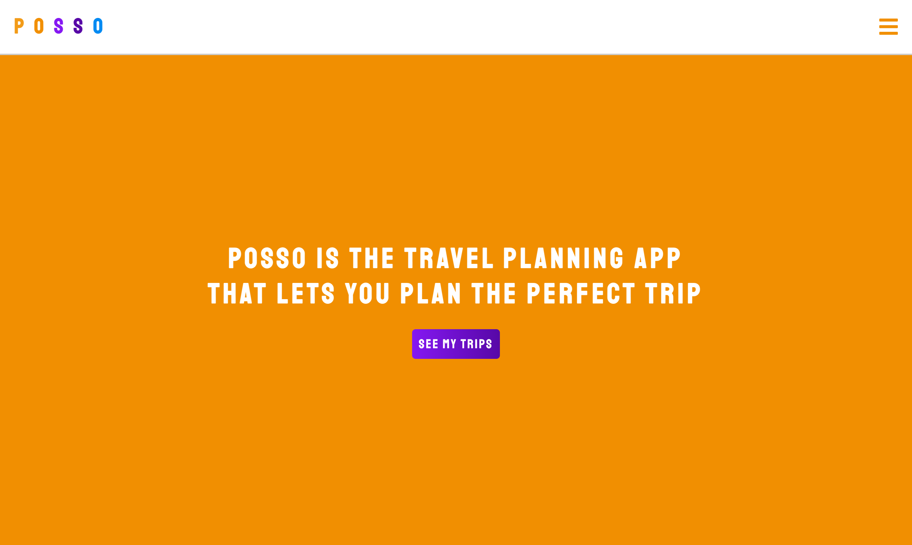
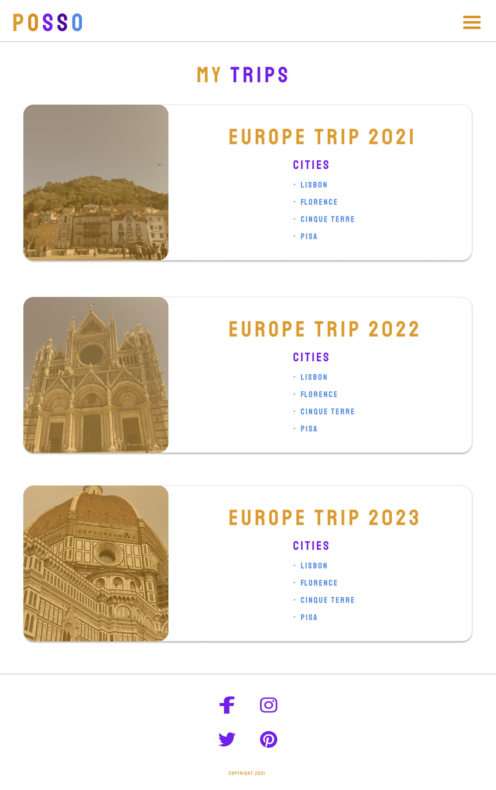

# POSSO
POSSO is a travel planning app where you can plan out your next vacation. At the moment, you can name your trips, add the dates, and then add the cities you will be going to, on your trip. 

## Technologies Used 
- Front-End 
  - HTML with EJS 
  - CSS 
  - JavaScript 
- Backend 
  - NodeJS 
  - Express
  - EJS
- Database Management 
  - MongoDB
  - Mongoose 

## Approach
In order to start off the basics of my app, I started with connecting everything in the backend to express and setting up my monngoose connection. Next, I created three Schemas that included the Trips, Cities, and Things To Do. I then focused on tying in the frontend using EJS. 

## MVP Goals
1. Have a fully CRUDable app to see, add, update, and delete trips. 
2. The user should be able to see all of their trips. 
3. The user should be able to add trips. 
4. The user should be able to update any of their trips. 
5. The user should be able to delete any of their trips

## Future Functionality 
As of now you can only add trips, but you can't add in the things you want to do and tie them to each individual city. My future goals for this project are: 
- To be able to add in things to do within the given categories 
- Switch out the date input on the front-end so you don't have to enter it manually
- Be able to check a thing to do off from a city once you have visited and add any notes
- Be able to share trips with your friends

## Wireframe 
